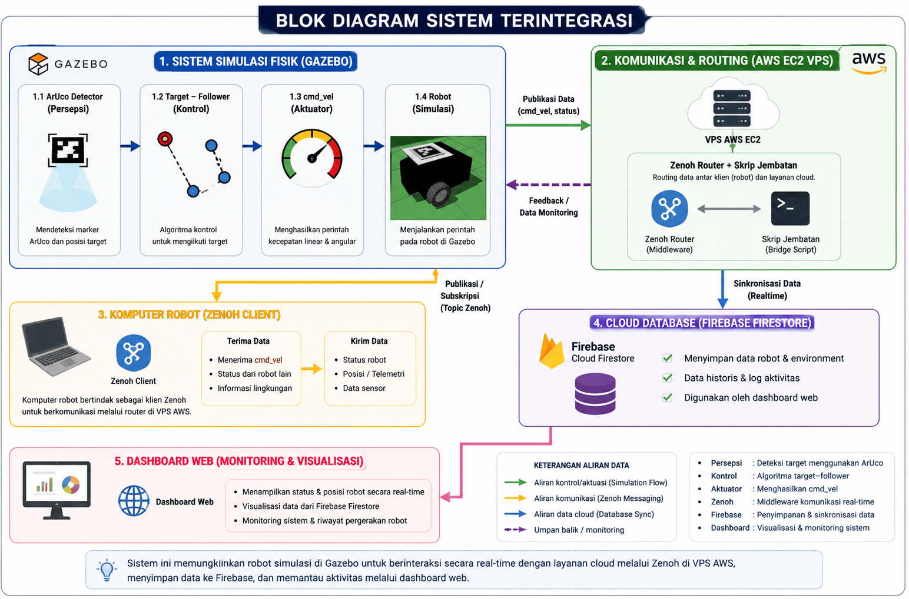

# SWARM_ROBOT — Ground Control

Sistem simulasi robot beroda (leader) yang dipandu kamera overhead (deteksi
ArUco marker) untuk bergerak otomatis menuju titik target, dapat dipantau
dan dikendalikan (otomatis maupun manual) dari dashboard web.

Repository ini berisi **dua versi arsitektur komunikasi** yang bisa dipilih.
Logika robot (deteksi ArUco, navigasi otomatis ke target) **sama persis** di
kedua versi — yang berbeda hanya cara robot terhubung ke dashboard web.

## 📦 Versi 1 — Zenoh + Firebase Firestore

➡️ Lihat [`v1_zenoh_firebase/README.md`](v1_zenoh_firebase/README.md)

Robot ⇄ Zenoh (client/router) ⇄ VPS ⇄ skrip jembatan Python ⇄ Firebase
Firestore ⇄ Dashboard Web. Sudah teruji stabil, mendukung riwayat data dan
lapisan keamanan Firestore.

## 📦 Versi 2 — WebSocket / rosbridge (tanpa Firebase)

➡️ Lihat [`v2_websocket_rosbridge/README_V2.md`](v2_websocket_rosbridge/README_V2.md)

Robot ⇄ rosbridge_websocket + web_video_server ⇄ reverse SSH tunnel ⇄ VPS
(sama dengan V1) ⇄ Dashboard Web langsung lewat `roslibjs`. Lebih sederhana
(tidak perlu skrip jembatan maupun basis data perantara), dengan tambahan
live video streaming — namun tanpa riwayat data dan tanpa lapisan keamanan
tambahan.

## ⚖️ Perbandingan Singkat V1 vs V2

| Aspek | V1 (Zenoh + Firebase) | V2 (WebSocket / rosbridge) |
|---|---|---|
| Middleware jaringan | Zenoh (client + router) | rosbridge_websocket + SSH reverse tunnel |
| Basis data perantara | Firebase Firestore | Tidak ada (koneksi langsung) |
| Skrip jembatan custom | Ya (`zenoh_to_firebase.py`) | Tidak perlu |
| Video kamera | Snapshot JPEG berkala | Live streaming MJPEG (`web_video_server`) |
| Riwayat/histori data | Tersimpan di Firestore | Tidak ada, kecuali dibuat sendiri |
| Keamanan akses | Ada lapisan Firestore security rules | Tidak ada (siapa pun yang tahu IP:port bisa akses) |

## 🎥 Video Demo Simulasi

### 📹 Versi 1 (Zenoh + Firebase)

[demo_simulasi.webm](https://github.com/user-attachments/assets/d916452a-bd7c-4885-9cea-c9c9c5797b34)

<!--
  CARA MENEMPEL VIDEO INI SUPAYA TERPUTAR LANGSUNG di halaman README
  (bukan cuma link biasa seperti di atas):
  1. Buka repo ini di github.com, klik file README.md, klik ikon pensil
     (Edit this file).
  2. Hapus baris link "📹 Tonton/unduh..." di atas.
  3. Drag & drop file docs/videos/demo_simulasi.webm (dari komputer Anda)
     ke posisi ini, tunggu upload selesai.
  4. Commit changes.
-->

### 📹 Versi 2 (WebSocket / rosbridge)

https://github.com/user-attachments/assets/f998c911-c0b7-4259-88b0-64dbff430b4d

<!--
  CARA MENEMPEL VIDEO INI SUPAYA TERPUTAR LANGSUNG di halaman README:
  1. Buka repo ini di github.com, klik file README.md, klik ikon pensil
     (Edit this file).
  2. Hapus baris link "📹 Tonton/unduh..." di atas.
  3. Drag & drop file docs/videos/demo_simulasi_v2.webm (dari komputer Anda)
     ke posisi ini, tunggu upload selesai.
  4. Commit changes.
-->

## 📄 Dokumentasi Lengkap

- [Laporan Praktikum](Laporan_Praktikum_Swarm_Robot.docx)
- [Panduan Simulasi V1](Panduan_Simulasi_Swarm_Robot.docx)
