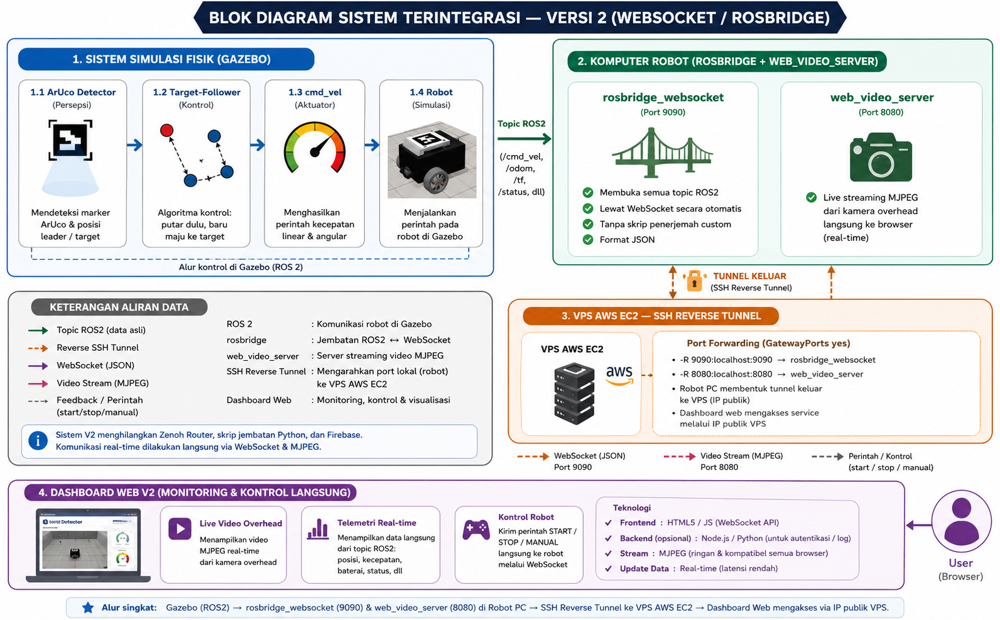

# SWARM_ROBOT — Versi 2 (WebSocket / rosbridge)

Versi ini adalah **arsitektur komunikasi alternatif** dari Versi 1
(Zenoh + Firebase). **Logika robot (deteksi ArUco, navigasi otomatis ke
target) sama persis dengan Versi 1** — yang berbeda **hanya jalur
komunikasinya**: menggantikan Zenoh + skrip jembatan Python + Firebase
Firestore dengan `rosbridge_websocket` + `web_video_server` + reverse SSH
tunnel ke VPS yang sama.

## Kenapa Versi 2 Lebih Sederhana



`rosbridge_websocket` secara otomatis membuka **semua** topic ROS2 lewat
WebSocket tanpa perlu skrip penerjemah custom. Dashboard V2 langsung
membaca/menulis topic ROS2 asli (`/aruco/leader_pose`, `/mission/start`,
`/cmd_vel`, dst.) — **tidak ada lagi** basis data perantara (Firestore),
**tidak ada lagi** skrip Python jembatan yang perlu dijaga jalan sebagai
systemd service.

### 🎥 Video Demo Simulasi (V2)

<!-- 
  CARA MENEMPEL VIDEO DI SINI (supaya video ikut terputar langsung
  di halaman README, bukan cuma jadi link biasa):
  1. Buka repo ini di github.com, klik file README_V2.md, klik ikon
     pensil (Edit this file).
  2. Cari baris tulisan "GANTI BARIS INI..." tepat di bawah komentar ini.
  3. Hapus baris itu, lalu drag & drop file video Anda (docs/videos/
     demo_simulasi_v2.webm) langsung ke kotak editor, PERSIS di posisi
     baris yang tadi dihapus.
  4. Tunggu sampai GitHub selesai meng-upload (progress bar), akan
     muncul otomatis satu baris link (https://github.com/user-
     attachments/assets/....) menggantikan posisi tadi.
  5. Scroll ke bawah, klik "Commit changes".
-->
GANTI BARIS INI dengan video Anda (lihat instruksi di komentar di atas)

## Perbandingan Singkat V1 vs V2

| Aspek | V1 (Zenoh + Firebase) | V2 (WebSocket / rosbridge) |
|---|---|---|
| Middleware jaringan | Zenoh (client + router) | rosbridge_websocket + SSH reverse tunnel |
| Basis data perantara | Firebase Firestore | Tidak ada (koneksi langsung) |
| Skrip jembatan custom | Ya (`zenoh_to_firebase.py`) | Tidak perlu |
| Video kamera | Snapshot JPEG berkala | Live streaming MJPEG (`web_video_server`) |
| Riwayat/histori data | Tersimpan di Firestore | Tidak ada, kecuali dibuat sendiri |
| Keamanan akses | Ada lapisan Firestore security rules | Tidak ada (siapa pun yang tahu IP:port bisa akses) |

## Prasyarat Tambahan (di luar yang sudah ada di V1)

Pasang paket ROS2 berikut di **komputer robot**:
```bash
sudo apt install -y \
  ros-jazzy-rosbridge-server \
  ros-jazzy-web-video-server
```

## Setup VPS (menggunakan VPS yang SAMA dengan V1)

Karena V2 tidak lagi memakai Zenoh router maupun skrip Python jembatan,
**service V1 di VPS (`zenoh-router.service`, `zenoh-firebase-bridge.service`)
boleh tetap dibiarkan jalan** (tidak bentrok, beda port) — atau dimatikan
kalau memang ingin fokus pakai V2 saja.

Yang perlu disiapkan di VPS untuk V2:

1. **Buka port tambahan di Security Group EC2**: 9090 (rosbridge) dan 8080
   (web_video_server), TCP, sama seperti waktu membuka port 7447 untuk Zenoh
   di V1.
2. **Izinkan reverse tunnel diakses dari luar** — edit file
   `/etc/ssh/sshd_config` di VPS, pastikan baris berikut ada dan tidak
   dikomentari:
   ```
   GatewayPorts yes
   ```
   Lalu restart service SSH:
   ```bash
   sudo systemctl restart ssh
   ```
   Tanpa pengaturan ini, port yang di-reverse-tunnel hanya bisa diakses dari
   VPS itu sendiri (localhost), bukan dari alamat IP publik VPS.

## Menjalankan Simulasi dengan V2

Simulasi Gazebo dan node ROS2 (`aruco_detector`, `target_follower`) dijalankan
**persis sama seperti V1**. Bedanya, V2 **tidak butuh** `camera_uploader.py`
(V1 punya ini di Terminal 3-nya, tapi di V2 dihapus karena video sudah
langsung di-live-stream oleh `web_video_server` — tidak perlu upload snapshot
berkala ke Firestore lagi).

Supaya tidak bingung, berikut **daftar lengkap & urutan pasti** terminal yang
perlu dibuka untuk V2 (total 3 terminal wajib + 1 terminal opsional untuk
dashboard):

| Terminal | Isi perintah | Fungsi |
|---|---|---|
| **1** | `gz sim ...` (simulasi Gazebo) | Menjalankan dunia simulasi & fisik robot |
| **2** | `ros2 launch swarm_robot simulation.launch.py` | Menjalankan node `aruco_detector` (deteksi marker) & `target_follower` (kontrol gerak) |
| **3** | `./connect_vps.sh` (lihat di bawah) | Membuka `rosbridge_websocket` (port 9090) + `web_video_server` (port 8080), lalu menyambungkannya ke VPS lewat SSH reverse tunnel |
| **4** *(opsional, lihat catatan)* | `python3 -m http.server` di folder `web_dashboard_v2` | Menyajikan file dashboard lewat `http://localhost:...` — **diperlukan kalau video kamera tidak mau muncul saat dashboard dibuka langsung sebagai file** (lihat penjelasan di bawah) |

**Terminal 1 — Gazebo** (sama seperti V1)

**Terminal 2 — Launch file ROS2** (sama seperti V1, `simulation.launch.py`
dari folder `robot_ws` V1 maupun V2 — isinya identik)

**Terminal 3 — rosbridge + web_video_server + tunnel ke VPS:**
```bash
cd v2_websocket_rosbridge/vps
cp connect_vps.example.sh connect_vps.sh
chmod +x connect_vps.sh
# edit connect_vps.sh: isi VPS_IP dan VPS_KEY sesuai VPS Anda
./connect_vps.sh
```
Tunggu sampai muncul log `[3/3] Membuka reverse SSH tunnel...` sebelum lanjut
ke langkah berikutnya. **Jangan tutup atau tekan Ctrl+C di terminal ini**
selama dashboard masih ingin dipakai.

### Kenapa kadang butuh Terminal ke-4 (server lokal untuk dashboard)

Beberapa browser (terutama Firefox) punya fitur keamanan yang otomatis
memaksa semua koneksi memakai `https://`, termasuk video kamera yang
sebetulnya dikirim lewat `http://` biasa oleh `web_video_server`. Kalau
dashboard dibuka langsung sebagai file (`file:///...`), fitur ini kadang
membuat video **gagal tampil** meski semua terminal lain sudah benar —
biasanya muncul pesan "Video belum tersambung" terus-menerus, atau di
Console browser (F12) terlihat pesan `Mixed Content: Upgrading insecure
display request`.

**Kalau ini terjadi**, buka satu terminal tambahan (Terminal ke-4) khusus
untuk menyajikan file dashboard lewat alamat `http://localhost:...` — dengan
begini, browser tidak lagi menganggapnya sebagai "file lokal" sehingga tidak
memaksa upgrade ke HTTPS:

```bash
cd v2_websocket_rosbridge/web_dashboard_v2
python3 -m http.server 8888
```
Biarkan terminal ini tetap terbuka, lalu buka dashboard lewat:
```
http://localhost:8888/dashboard_v2.html
```
(bukan lewat `file:///...` lagi)

Kalau video kamera **sudah muncul normal** saat dashboard dibuka langsung
sebagai file, Terminal ke-4 ini **tidak perlu** dipakai — cukup 3 terminal
wajib di atas.

## Membuka Dashboard V2

Buka `web_dashboard_v2/dashboard_v2.html` di browser (langsung sebagai file,
atau lewat `http://localhost:.../dashboard_v2.html` kalau memakai Terminal
ke-4 di atas), isi kolom IP publik VPS Anda, klik **Sambungkan**. Video
kamera overhead akan langsung live-streaming, telemetri (posisi
leader/target, status misi) akan update real-time, dan tombol
START/STOP/manual langsung mengirim perintah ke robot tanpa perantara basis
data apa pun.

## Catatan Keamanan

Karena V2 tidak memiliki lapisan keamanan (siapa pun yang tahu IP VPS dan
port 9090/8080 dapat terhubung dan mengirim perintah ke robot Anda), V2
**disarankan hanya untuk keperluan pengujian/demo**, bukan untuk penggunaan
produksi jangka panjang tanpa menambahkan lapisan keamanan tambahan
(misalnya autentikasi pada rosbridge, atau membatasi akses lewat firewall
VPS ke IP tertentu saja).
